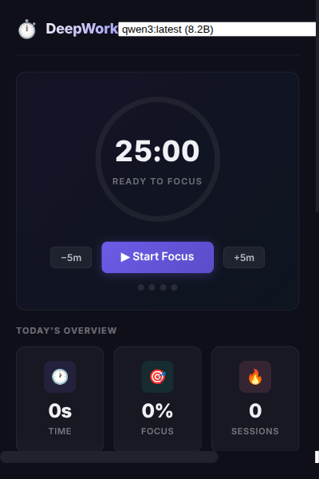
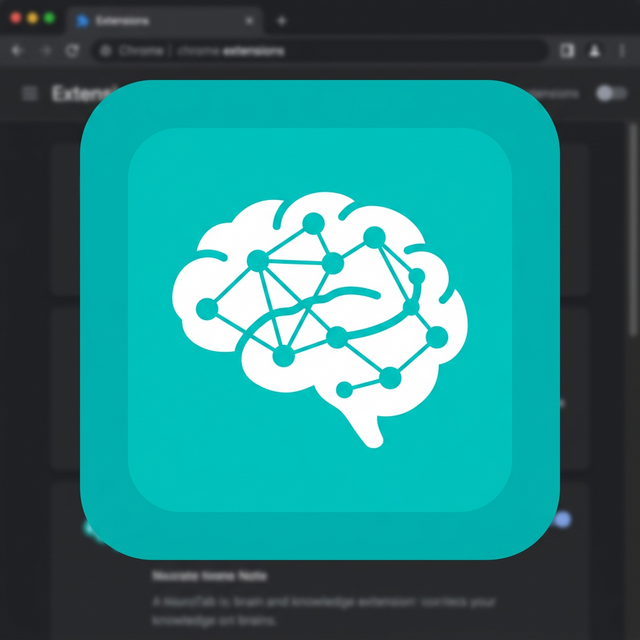
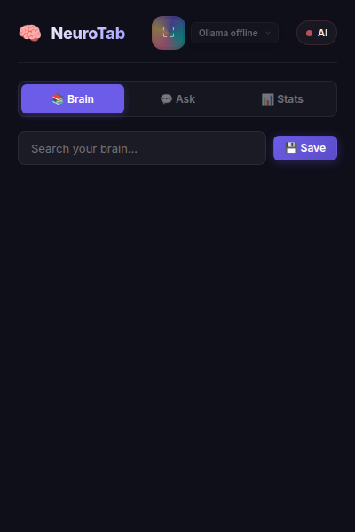
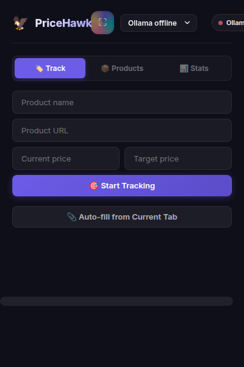
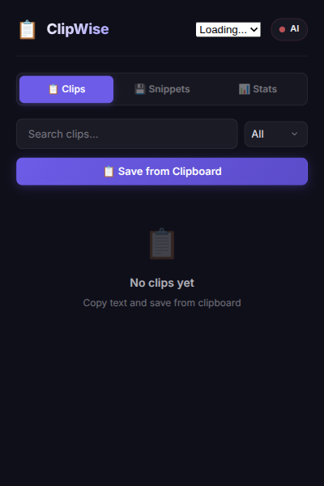
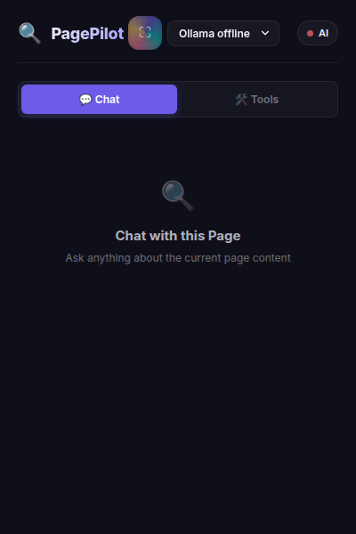

# 🚀 Chrome Extensions Suite

> **5 Privacy-First, AI-Powered Chrome Extensions** — All data stays local. Zero cloud dependency. Powered by [Ollama](https://ollama.ai).

---

## ✨ Extensions

### ⏱️ DeepWork Guardian — Focus & Productivity

<table>
  <tr>
    <td width="60%" valign="top">
      
      <br>
      <strong>AI-powered focus timer, distraction blocking, and browsing analytics.</strong>
      <br><br>
      Track time on every website automatically. Use Pomodoro-style focus sessions with smart break management. Block distracting sites during focus time with a beautiful motivational block page. Full analytics dashboard with 6 chart types — daily screen time, focus score trends, category breakdown, top sites, hourly activity heatmap, and AI-generated productivity insights via Ollama.
      <br><br>
      <strong>Key Features:</strong> Pomodoro Timer · Site Blocking · Time Tracking · Analytics Dashboard · AI Insights
    </td>
    <td width="40%" valign="top" align="center">
      <a href=".github/screenshots/deepwork-guardian_screenshot.png">
        
      </a>
    </td>
  </tr>
</table>

---

### 🧠 NeuroTab — AI Second Brain

<table>
  <tr>
    <td width="60%" valign="top">
      
      <br>
      <strong>Save, summarize, and search everything you read online.</strong>
      <br><br>
      One-click save any page or text selection to your local knowledge base. Ollama auto-generates summaries and intelligent tags. Search across your entire reading history instantly. Ask your brain questions using RAG-style Q&A — the AI answers based on everything you've saved. Right-click context menus for quick save and summarize.
      <br><br>
      <strong>Key Features:</strong> Knowledge Base · AI Summarization · Smart Tags · Ask Your Brain (RAG Q&A) · Stats Dashboard
    </td>
    <td width="40%" valign="top" align="center">
      <a href=".github/screenshots/neurotab_screenshot.png">
        
      </a>
    </td>
  </tr>
</table>

---

### 💰 PriceHawk — Local Price Tracker

<table>
  <tr>
    <td width="60%" valign="top">
      
      <br>
      <strong>Track product prices locally, detect fake sales, and get AI deal analysis.</strong>
      <br><br>
      Add products with one click (auto-fills from current tab). Record price history over time with visual mini-charts. Automatic fake sale detection flags suspicious deals when the "sale" price is close to the historical average. AI deal analysis via Ollama tells you if it's a good time to buy. Get price drop notifications when products hit your target price.
      <br><br>
      <strong>Key Features:</strong> Price History Charts · Fake Sale Detection · AI Deal Analysis · Price Drop Alerts · Auto-fill
    </td>
    <td width="40%" valign="top" align="center">
      <a href=".github/screenshots/pricehawk_screenshot.png">
        
      </a>
    </td>
  </tr>
</table>

---

### 📋 ClipWise — Smart Clipboard Manager

<table>
  <tr>
    <td width="60%" valign="top">
      
      <br>
      <strong>AI-powered clipboard history, code snippets, and text enhancement.</strong>
      <br><br>
      Save clipboard contents with smart type detection (code, URLs, commands, emails, text). Search and filter your clip history. Save reusable code snippets with language tagging. AI text actions via context menu — explain, summarize, improve writing, or translate any selected text. Full stats with clip type breakdown and daily activity charts.
      <br><br>
      <strong>Key Features:</strong> Clipboard History · Code Snippets · AI Explain/Summarize/Improve/Translate · Type Detection · Stats
    </td>
    <td width="40%" valign="top" align="center">
      <a href=".github/screenshots/clipwise_screenshot.png">
        
      </a>
    </td>
  </tr>
</table>

---

### 🔍 PagePilot — AI Page Assistant & Dev Toolkit

<table>
  <tr>
    <td width="60%" valign="top">
      
      <br>
      <strong>Chat with any page using AI, plus 8 essential developer quick tools.</strong>
      <br><br>
      Ask questions about any webpage's content — Ollama reads the page and answers contextually. Includes a full developer toolkit: JSON formatter/minifier, Base64 encode/decode, URL encode/decode, Unix timestamp converter, Lorem Ipsum generator, word/character counter, color converter (HEX↔RGB↔HSL), and regex tester with match highlighting.
      <br><br>
      <strong>Key Features:</strong> AI Page Chat · JSON Formatter · Base64 · Timestamp · Color Converter · Regex Tester · Word Counter
    </td>
    <td width="40%" valign="top" align="center">
      <a href=".github/screenshots/pagepilot_screenshot.png">
        
      </a>
    </td>
  </tr>
</table>

---

## 🔒 Privacy Principles

| Principle | Details |
|-----------|---------|
| **100% Local Data** | All data stored in `chrome.storage.local` — never leaves your machine |
| **Zero Cloud** | No external servers, no telemetry, no tracking, no analytics |
| **Local AI** | AI features powered by Ollama running on your own hardware |
| **Open Source** | Full source code, no obfuscation, no hidden network calls |

---

## 🛠️ Getting Started

### Prerequisites

- **Google Chrome** (Manifest V3 compatible)
- **Ollama** (for AI features) — [Install Ollama](https://ollama.ai)

### Installation

```bash
# 1. Start Ollama and pull a model
ollama serve
ollama pull llama3.2

# 2. Load extension in Chrome
# → Navigate to chrome://extensions/
# → Enable "Developer mode"
# → Click "Load unpacked"
# → Select any extension folder (e.g., deepwork-guardian/)
```

### Project Structure

```
extensions-google-chrome/
├── shared/                  # Shared utilities (copied into each extension)
│   ├── ui-components.css    # Design system — dark theme + glassmorphism
│   ├── chart-utils.js       # Canvas-based charting library
│   ├── ollama-client.js     # Ollama API client
│   └── storage-utils.js     # Chrome storage helpers
├── deepwork-guardian/       # ⏱️ Focus & Analytics
├── neurotab/                # 🧠 AI Second Brain
├── pricehawk/               # 💰 Price Tracker
├── clipwise/                # 📋 Clipboard Manager
└── pagepilot/               # 🔍 Page Assistant & Dev Tools
```

---

## 🧰 Tech Stack

- **Vanilla HTML/CSS/JS** — No frameworks, no build step
- **Chrome Extension Manifest V3** — Modern service workers
- **Canvas API** — Lightweight charts with no dependencies
- **Ollama REST API** — Local AI inference
- **IndexedDB + chrome.storage.local** — Persistent local storage

---

<p align="center">
  <strong>Built with 🧠 by a developer, for developers</strong><br>
  <em>Zero dependencies · Zero cloud · 100% private</em>
</p>
