# 🚀 Chrome Extensions Suite

> **8 Privacy-First, AI-Powered Chrome Extensions** — All data stays local. Zero cloud dependency. Powered by [Ollama](https://ollama.ai).

---

## ✨ Extensions


<p align="center">
  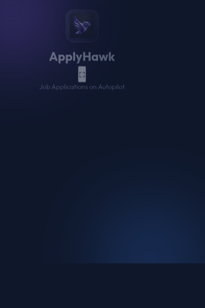
</p>
### 1) DeepWork Guardian

<div align="left" style="display: flex; align-items: flex-start; gap: 20px; margin-bottom: 20px;">
  <div style="flex: 0 0 80px; text-align: center;">
    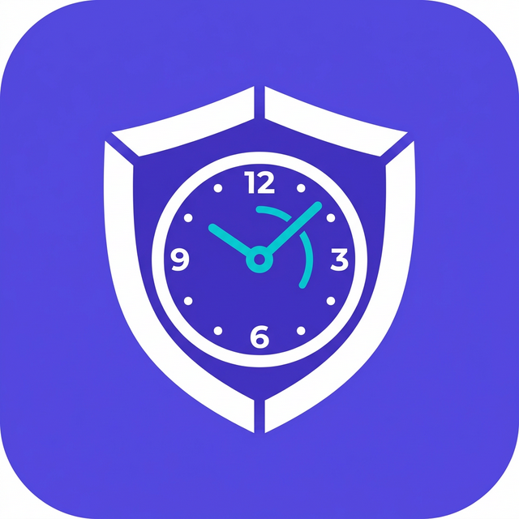
  </div>
  <div style="flex: 1; padding: 0 20px;">
    <p><strong>Purpose:</strong> Productivity coaching during focused work blocks.</p>
    <ul>
      <li>Pomodoro timer & breaks</li>
      <li>Distraction blocking</li>
      <li>Browsing analytics</li>
      <li>Local dashboard views</li>
      <li>Optional Ollama insights</li>
    </ul>
  </div>
  <div style="flex: 0 0 220px; text-align: center;">
    <a href=".github/screenshots/deepwork-guardian_screenshot.png"></a>
  </div>
</div>

<br clear="all" />

---

### 2) NeuroTab

<div align="left" style="display: flex; align-items: flex-start; gap: 20px; margin-bottom: 20px;">
  <div style="flex: 0 0 80px; text-align: center;">
    
  </div>
  <div style="flex: 1; padding: 0 20px;">
    <p><strong>Purpose:</strong> Save and reason over what you read online.</p>
    <ul>
      <li>Capture page/selection</li>
      <li>Generate summaries/tags</li>
      <li>Searchable local knowledge base</li>
      <li>Q&A over saved content</li>
    </ul>
  </div>
  <div style="flex: 0 0 220px; text-align: center;">
    <a href=".github/screenshots/neurotab_screenshot.png"></a>
  </div>
</div>

<br clear="all" />

---

### 3) PriceHawk

<div align="left" style="display: flex; align-items: flex-start; gap: 20px; margin-bottom: 20px;">
  <div style="flex: 0 0 80px; text-align: center;">
    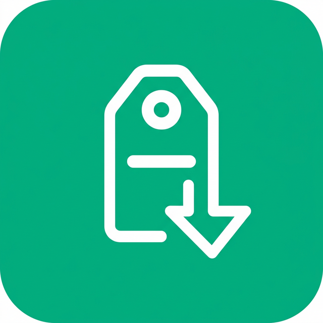
  </div>
  <div style="flex: 1; padding: 0 20px;">
    <p><strong>Purpose:</strong> Monitor products over time and avoid misleading discounts.</p>
    <ul>
      <li>Manual/assisted product capture</li>
      <li>Historical tracking</li>
      <li>Suspicious sale checks</li>
      <li>AI-assisted buy/no-buy guidance</li>
    </ul>
  </div>
  <div style="flex: 0 0 220px; text-align: center;">
    <a href=".github/screenshots/pricehawk_screenshot.png"></a>
  </div>
</div>

<br clear="all" />

---

### 4) ClipWise

<div align="left" style="display: flex; align-items: flex-start; gap: 20px; margin-bottom: 20px;">
  <div style="flex: 0 0 80px; text-align: center;">
    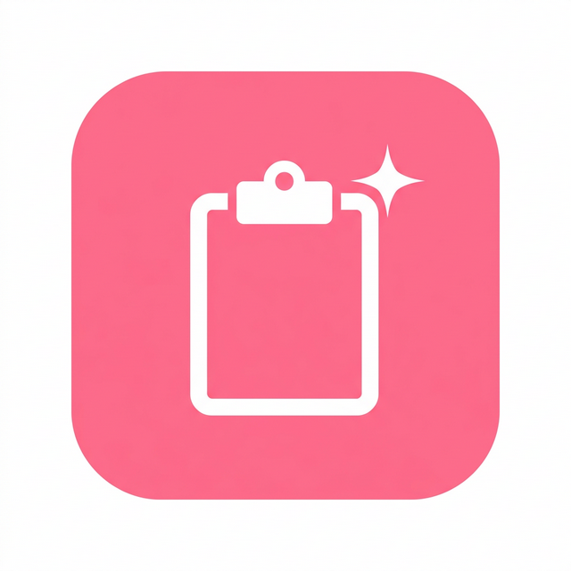
  </div>
  <div style="flex: 1; padding: 0 20px;">
    <p><strong>Purpose:</strong> Keep clipboard data reusable and organized.</p>
    <ul>
      <li>Clipboard archive</li>
      <li>Snippet saving</li>
      <li>Clip type categorization</li>
      <li>AI transform actions</li>
    </ul>
  </div>
  <div style="flex: 0 0 220px; text-align: center;">
    <a href=".github/screenshots/clipwise_screenshot.png"></a>
  </div>
</div>

<br clear="all" />

---

### 5) PagePilot

<div align="left" style="display: flex; align-items: flex-start; gap: 20px; margin-bottom: 20px;">
  <div style="flex: 0 0 80px; text-align: center;">
    
  </div>
  <div style="flex: 1; padding: 0 20px;">
    <p><strong>Purpose:</strong> Fast page understanding + handy dev tools in one popup.</p>
    <ul>
      <li>Chat with current page context</li>
      <li>Formatter/converter mini-tools</li>
      <li>Regex testing and utility helpers</li>
      <li>Color converter</li>
    </ul>
  </div>
  <div style="flex: 0 0 220px; text-align: center;">
    <a href=".github/screenshots/pagepilot_screenshot.png"></a>
  </div>
</div>

<br clear="all" />

---

### 6) GitPulse

<div align="left" style="display: flex; align-items: flex-start; gap: 20px; margin-bottom: 20px;">
  <div style="flex: 0 0 80px; text-align: center;">
    
  </div>
  <div style="flex: 1; padding: 0 20px;">
    <p><strong>Purpose:</strong> Centralize PR review work.</p>
    <ul>
      <li>Inbox for review requests/authored PRs</li>
      <li>Urgency indicators</li>
      <li>AI PR summaries</li>
      <li>Velocity-oriented stats</li>
    </ul>
  </div>
  <div style="flex: 0 0 220px; text-align: center;">
    <a href=".github/screenshots/gitpulse_screenshot.png">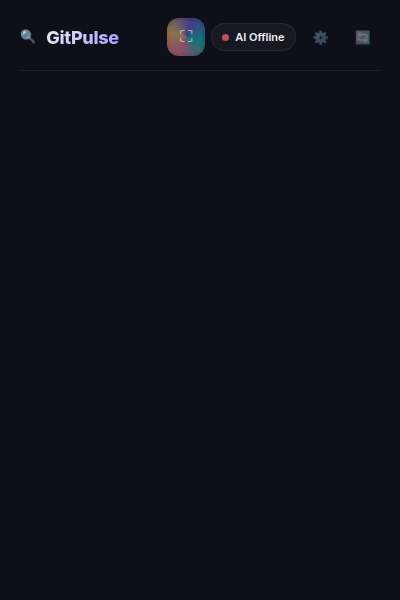</a>
  </div>
</div>

<br clear="all" />

---

### 7) GhostHunter

<div align="left" style="display: flex; align-items: flex-start; gap: 20px; margin-bottom: 20px;">
  <div style="flex: 0 0 80px; text-align: center;">
    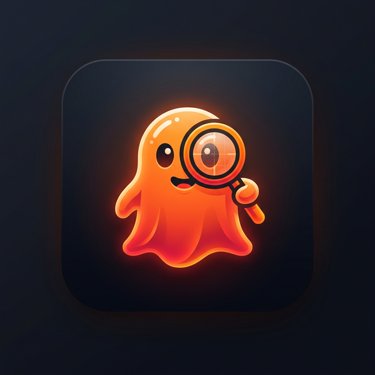
  </div>
  <div style="flex: 1; padding: 0 20px;">
    <p><strong>Purpose:</strong> Identify suspicious job postings.</p>
    <ul>
      <li>Supported on LinkedIn, Indeed, Glassdoor, Wellfound</li>
      <li>Risk badges & listing signal checks</li>
      <li>Application tracking</li>
    </ul>
  </div>
  <div style="flex: 0 0 220px; text-align: center;">
    <a href=".github/screenshots/ghosthunter_screenshot.png">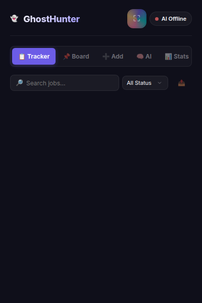</a>
  </div>
</div>

<br clear="all" />

---

### 8) CodeArmor

<div align="left" style="display: flex; align-items: flex-start; gap: 20px; margin-bottom: 20px;">
  <div style="flex: 0 0 80px; text-align: center;">
    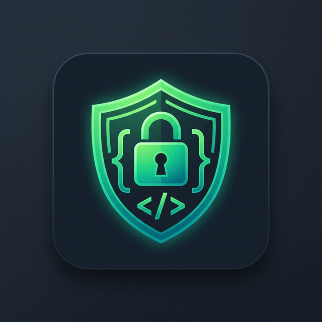
  </div>
  <div style="flex: 1; padding: 0 20px;">
    <p><strong>Purpose:</strong> Reduce accidental credential leakage.</p>
    <ul>
      <li>Paste interception on risky pages</li>
      <li>Pattern-based secret detection</li>
      <li>Vault of known secrets</li>
      <li>Dashboard metrics</li>
    </ul>
  </div>
  <div style="flex: 0 0 220px; text-align: center;">
    <a href=".github/screenshots/codearmor_screenshot.png">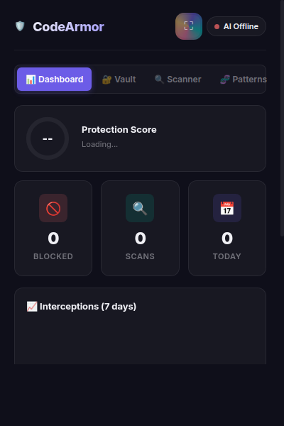</a>
  </div>
</div>

<br clear="all" />

---

### 9) ApplyHawk

<div align="left" style="display: flex; align-items: flex-start; gap: 20px; margin-bottom: 20px;">
  <div style="flex: 0 0 80px; text-align: center;">
    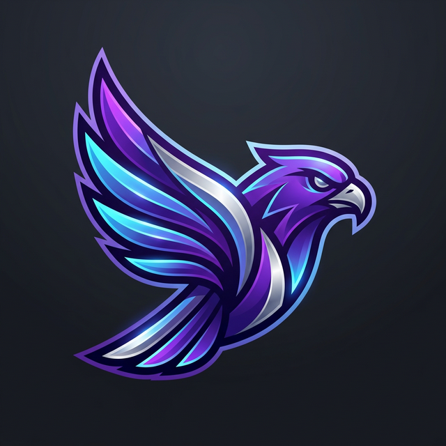
  </div>
  <div style="flex: 1; padding: 0 20px;">
    <p><strong>Purpose:</strong> Speed up repetitive job applications.</p>
    <ul>
      <li>Autofill on major job form flows</li>
      <li>Local profile data</li>
      <li>Activity tracking</li>
      <li>AI-assisted cover-letter generation</li>
    </ul>
  </div>
  <div style="flex: 0 0 220px; text-align: center;">
    <a href=".github/screenshots/applyhawk_screenshot.png">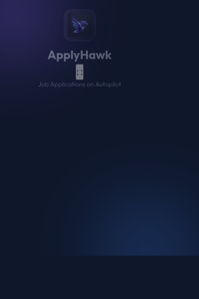</a>
  </div>
</div>

<br clear="all" />

---

### 10) FocusLock

<div align="left" style="display: flex; align-items: flex-start; gap: 20px; margin-bottom: 20px;">
  <div style="flex: 0 0 80px; text-align: center;">
    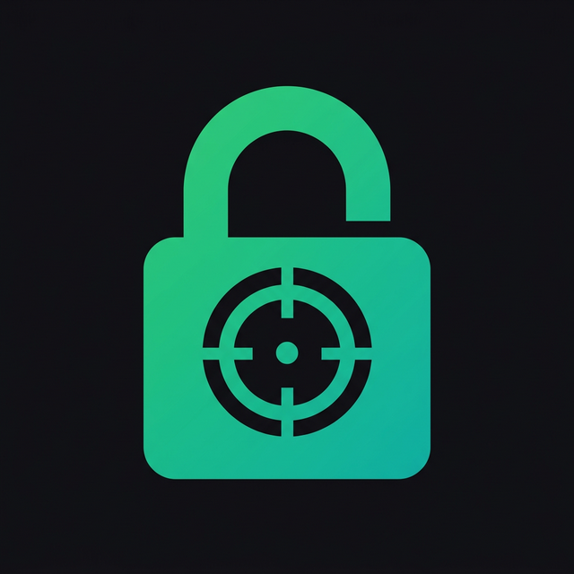
  </div>
  <div style="flex: 1; padding: 0 20px;">
    <p><strong>Purpose:</strong> Maintain flow state while browsing.</p>
    <ul>
      <li>Deep work mode</li>
      <li>Context-aware nudges</li>
      <li>Score-based focus tracking</li>
      <li>Local productivity analytics</li>
    </ul>
  </div>
  <div style="flex: 0 0 220px; text-align: center;">
    <a href=".github/screenshots/focuslock_screenshot.png">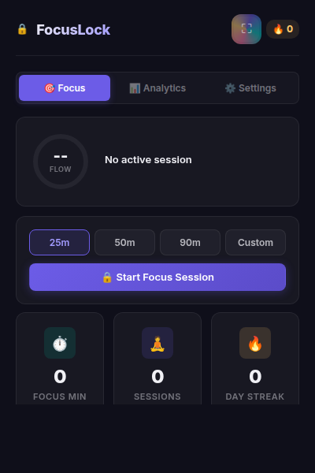</a>
  </div>
</div>

<br clear="all" />

---

### 11) PromptChain

<div align="left" style="display: flex; align-items: flex-start; gap: 20px; margin-bottom: 20px;">
  <div style="flex: 0 0 80px; text-align: center;">
    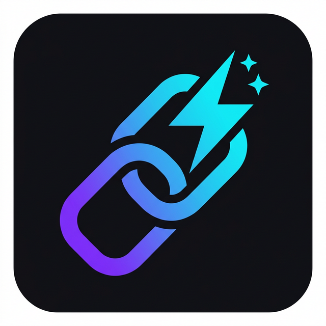
  </div>
  <div style="flex: 1; padding: 0 20px;">
    <p><strong>Purpose:</strong> Run repeatable multi-step AI tasks locally.</p>
    <ul>
      <li>Chain builder & execution runner</li>
      <li>Saved chain library</li>
      <li>Page-context prompts</li>
      <li>Model selection</li>
    </ul>
  </div>
  <div style="flex: 0 0 220px; text-align: center;">
    <a href=".github/screenshots/promptchain_screenshot.png">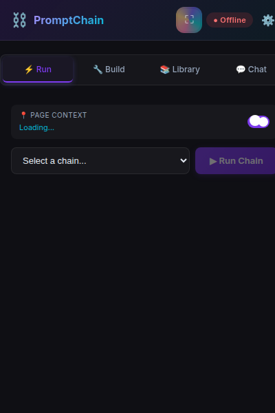</a>
  </div>
</div>

<br clear="all" />

---

### 12) StandupScribe

<div align="left" style="display: flex; align-items: flex-start; gap: 20px; margin-bottom: 20px;">
  <div style="flex: 0 0 80px; text-align: center;">
    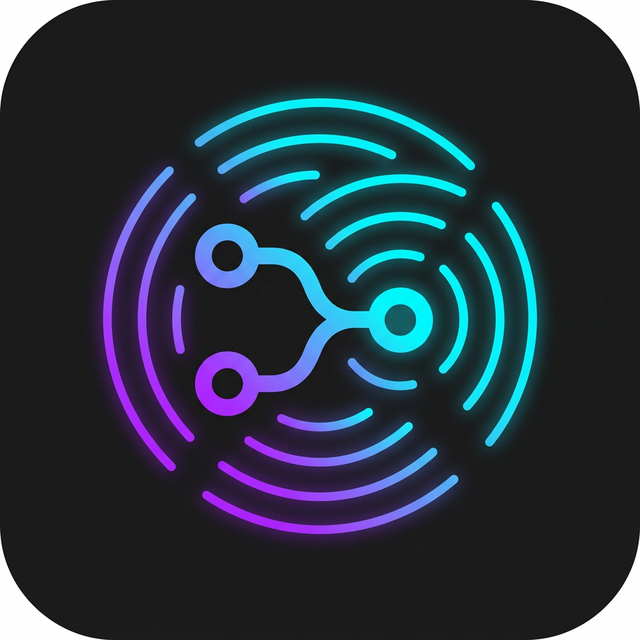
  </div>
  <div style="flex: 1; padding: 0 20px;">
    <p><strong>Purpose:</strong> Generate standup updates from your actual browsing/work activity.</p>
    <ul>
      <li>Auto-generated Yesterday/Today/Blockers</li>
      <li>Editable drafts</li>
      <li>History view</li>
      <li>AI model integration</li>
    </ul>
  </div>
  <div style="flex: 0 0 220px; text-align: center;">
    <a href=".github/screenshots/standupscribe_screenshot.png">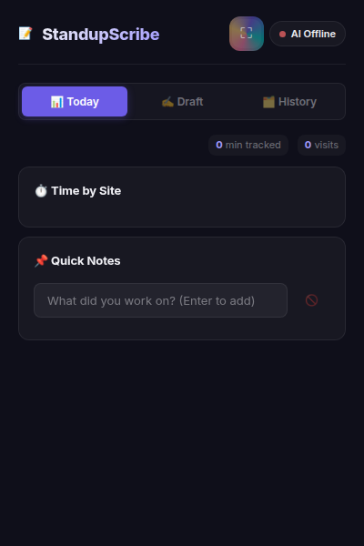</a>
  </div>
</div>

<br clear="all" />

---

### 13) TabVault

<div align="left" style="display: flex; align-items: flex-start; gap: 20px; margin-bottom: 20px;">
  <div style="flex: 0 0 80px; text-align: center;">
    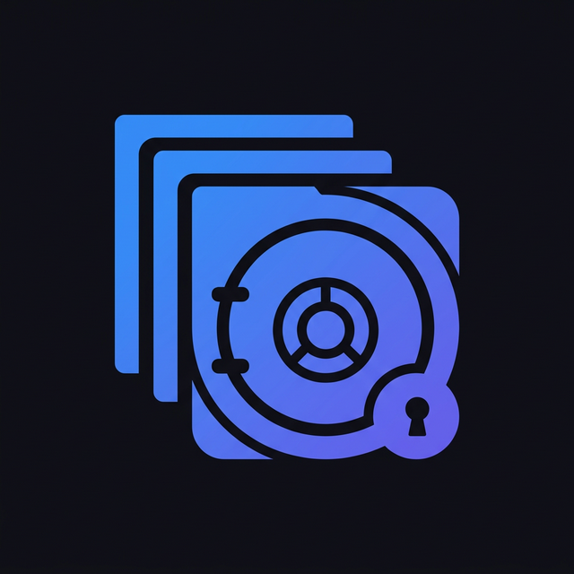
  </div>
  <div style="flex: 1; padding: 0 20px;">
    <p><strong>Purpose:</strong> Manage tab sprawl and session recovery.</p>
    <ul>
      <li>Save/restore tab sets</li>
      <li>Stale-tab detection</li>
      <li>Memory estimate panel</li>
      <li>Optional AI-generated session summaries</li>
    </ul>
  </div>
  <div style="flex: 0 0 220px; text-align: center;">
    <a href=".github/screenshots/tabvault_screenshot.png">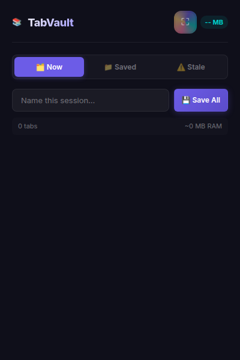</a>
  </div>
</div>

<br clear="all" />

---

## 🔒 Privacy Principles

| Principle | Details |
|-----------|---------|
| **100% Local Data** | All data stored in `chrome.storage.local` — never leaves your machine |
| **Zero Cloud** | No external servers, no telemetry, no tracking, no analytics |
| **Local AI** | AI features powered by Ollama running on your own hardware |
| **Open Source** | Full source code, no obfuscation, no hidden network calls |

---

## 🛠️ Getting Started

### Prerequisites

- **Google Chrome** (Manifest V3 compatible)
- **Ollama** (for AI features) — [Install Ollama](https://ollama.ai)

### Installation

```bash
# 1. Start Ollama and pull a model
ollama serve
ollama pull llama3.2

# 2. Load extension in Chrome
# → Navigate to chrome://extensions/
# → Enable "Developer mode"
# → Click "Load unpacked"
# → Select any extension folder (e.g., deepwork-guardian/)
```

### Project Structure

```
extensions-google-chrome/
├── shared/                  # Shared utilities (copied into each extension)
│   ├── ui-components.css    # Design system — dark theme + glassmorphism
│   ├── chart-utils.js       # Canvas-based charting library
│   ├── ollama-client.js     # Ollama API client
│   └── storage-utils.js     # Chrome storage helpers
├── deepwork-guardian/       # ⏱️ Focus & Analytics
├── neurotab/                # 🧠 AI Second Brain
├── pricehawk/               # 💰 Price Tracker
├── clipwise/                # 📋 Clipboard Manager
└── pagepilot/               # 🔍 Page Assistant & Dev Tools
```

---

## 🧰 Tech Stack

- **Vanilla HTML/CSS/JS** — No frameworks, no build step
- **Chrome Extension Manifest V3** — Modern service workers
- **Canvas API** — Lightweight charts with no dependencies
- **Ollama REST API** — Local AI inference
- **IndexedDB + chrome.storage.local** — Persistent local storage

---

<p align="center">
  <strong>Built with 🧠 by a developer, for developers</strong><br>
  <em>Zero dependencies · Zero cloud · 100% private</em>
</p>
