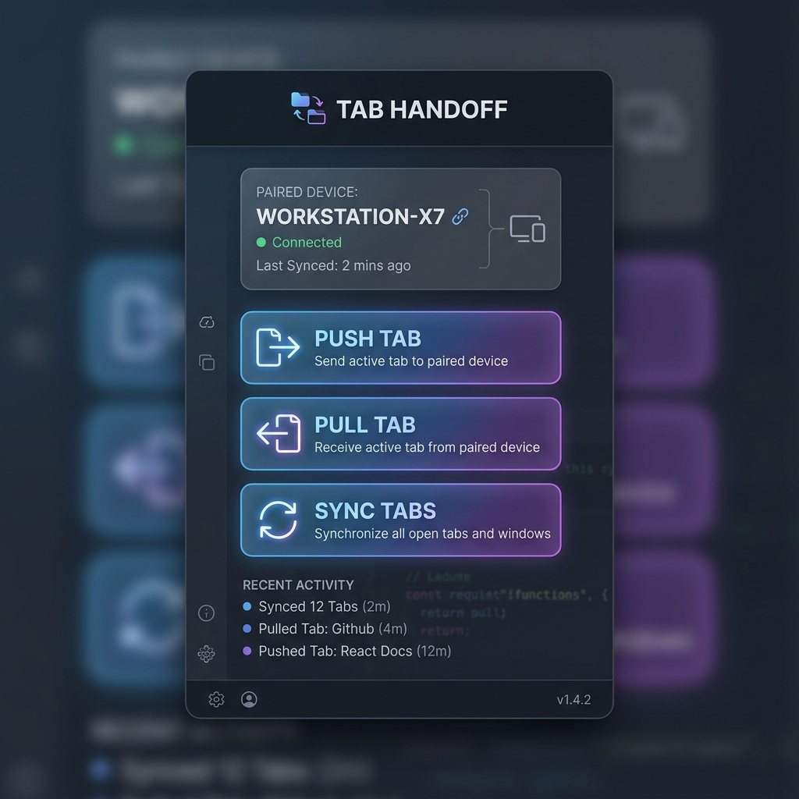
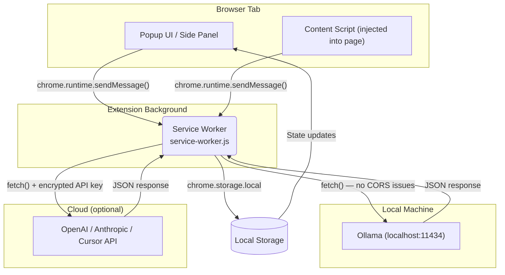
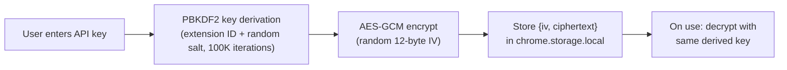

# 🚀 Chrome Extensions Suite

> **14 Privacy-First, AI-Powered Chrome Extensions** — All data stays local. Zero cloud dependency. Powered by [Ollama](https://ollama.ai).

---

## ✨ Extensions

### 1) DeepWork Guardian

<table width="100%">
  <tr>
    <td width="15%" align="center" valign="top">
      
    </td>
    <td width="45%" valign="top">
      <p><strong>Purpose:</strong> Productivity coaching during focused work blocks.</p>
      <ul>
        <li>⏲️ Smart Pomodoro timer & breaks</li>
        <li>🛡️ Advanced distraction blocking</li>
        <li>📊 Deep-dive browsing analytics</li>
        <li>🏠 Local dashboard & insights</li>
        <li>🤖 Optional Ollama integration</li>
      </ul>
    </td>
    <td width="40%" align="center" valign="top">
      <a href=".github/screenshots/deepwork-guardian_screenshot.png"></a>
    </td>
  </tr>
</table>

---

### 2) NeuroTab

<table width="100%">
  <tr>
    <td width="15%" align="center" valign="top">
      
    </td>
    <td width="45%" valign="top">
      <p><strong>Purpose:</strong> Save and reason over what you read online.</p>
      <ul>
        <li>📸 1-click capture page/selection</li>
        <li>🏷️ AI-generated summaries & tags</li>
        <li>🧠 Searchable local knowledge base</li>
        <li>💬 Interactive Q&A over saved content</li>
      </ul>
    </td>
    <td width="40%" align="center" valign="top">
      <a href=".github/screenshots/neurotab_screenshot.png"></a>
    </td>
  </tr>
</table>

---

### 3) PriceHawk

<table width="100%">
  <tr>
    <td width="15%" align="center" valign="top">
      
    </td>
    <td width="45%" valign="top">
      <p><strong>Purpose:</strong> Monitor products over time and avoid misleading discounts.</p>
      <ul>
        <li>🛒 Manual & automated product capture</li>
        <li>📈 Detailed historical price tracking</li>
        <li>🚨 Suspicious sale & fake discount checks</li>
        <li>💡 AI-assisted buy/no-buy guidance</li>
      </ul>
    </td>
    <td width="40%" align="center" valign="top">
      <a href=".github/screenshots/pricehawk_screenshot.png"></a>
    </td>
  </tr>
</table>

---

### 4) ClipWise

<table width="100%">
  <tr>
    <td width="15%" align="center" valign="top">
      
    </td>
    <td width="45%" valign="top">
      <p><strong>Purpose:</strong> Keep clipboard data reusable and organized.</p>
      <ul>
        <li>📂 Comprehensive clipboard archive</li>
        <li>💾 Persistent snippet saving</li>
        <li>s️ Smart clip type categorization</li>
        <li>✨ AI-powered text transform actions</li>
      </ul>
    </td>
    <td width="40%" align="center" valign="top">
      <a href=".github/screenshots/clipwise_screenshot.png"></a>
    </td>
  </tr>
</table>

---

### 5) PagePilot

<table width="100%">
  <tr>
    <td width="15%" align="center" valign="top">
      
    </td>
    <td width="45%" valign="top">
      <p><strong>Purpose:</strong> Fast page understanding + handy dev tools in one popup.</p>
      <ul>
        <li>💬 Contextual chat with the active page</li>
        <li>🛠️ Quick formatter/converter mini-tools</li>
        <li>🔍 Regex testing & utility helpers</li>
        <li>🎨 Instant color format converter</li>
      </ul>
    </td>
    <td width="40%" align="center" valign="top">
      <a href=".github/screenshots/pagepilot_screenshot.png"></a>
    </td>
  </tr>
</table>

---

### 6) GitPulse

<table width="100%">
  <tr>
    <td width="15%" align="center" valign="top">
      
    </td>
    <td width="45%" valign="top">
      <p><strong>Purpose:</strong> Centralize PR review work.</p>
      <ul>
        <li>📥 Unified inbox for PR review requests</li>
        <li>🔥 Smart urgency indicators</li>
        <li>📝 AI-generated PR summaries</li>
        <li>📊 Velocity & code review stats</li>
      </ul>
    </td>
    <td width="40%" align="center" valign="top">
      <a href=".github/screenshots/gitpulse_screenshot.png"></a>
    </td>
  </tr>
</table>

---

### 7) GhostHunter

<table width="100%">
  <tr>
    <td width="15%" align="center" valign="top">
      
    </td>
    <td width="45%" valign="top">
      <p><strong>Purpose:</strong> Identify suspicious job postings.</p>
      <ul>
        <li>🌐 Works on LinkedIn, Indeed, Glassdoor</li>
        <li>⚠️ Risk badges & fake listing signals</li>
        <li>📋 Automated application tracking</li>
        <li>🔎 Deep-dive employer background checks</li>
      </ul>
    </td>
    <td width="40%" align="center" valign="top">
      <a href=".github/screenshots/ghosthunter_screenshot.png"></a>
    </td>
  </tr>
</table>

---

### 8) CodeArmor

<table width="100%">
  <tr>
    <td width="15%" align="center" valign="top">
      
    </td>
    <td width="45%" valign="top">
      <p><strong>Purpose:</strong> Reduce accidental credential leakage.</p>
      <ul>
        <li>🛑 Paste interception on risky domains</li>
        <li>🔑 Pattern-based secret detection</li>
        <li>🗄️ Secure local vault of known secrets</li>
        <li>📈 Dashboard metrics & risk reports</li>
      </ul>
    </td>
    <td width="40%" align="center" valign="top">
      <a href=".github/screenshots/codearmor_screenshot.png"></a>
    </td>
  </tr>
</table>

---

### 9) ApplyHawk

<table width="100%">
  <tr>
    <td width="15%" align="center" valign="top">
      
    </td>
    <td width="45%" valign="top">
      <p><strong>Purpose:</strong> Speed up repetitive job applications.</p>
      <ul>
        <li>⚡ Autofill across major job portals</li>
        <li>📁 Local profile & resume data storage</li>
        <li>📅 Comprehensive activity tracking</li>
        <li>✍️ AI-assisted cover-letter generator</li>
      </ul>
    </td>
    <td width="40%" align="center" valign="top">
      <a href=".github/screenshots/applyhawk_screenshot.png"></a>
    </td>
  </tr>
</table>

---

### 10) FocusLock

<table width="100%">
  <tr>
    <td width="15%" align="center" valign="top">
      
    </td>
    <td width="45%" valign="top">
      <p><strong>Purpose:</strong> Maintain flow state while browsing.</p>
      <ul>
        <li>🧘 Dedicated deep work mode</li>
        <li>🔔 Context-aware nudges & alerts</li>
        <li>🎯 Score-based focus tracking</li>
        <li>📊 Local productivity analytics</li>
      </ul>
    </td>
    <td width="40%" align="center" valign="top">
      <a href=".github/screenshots/focuslock_screenshot.png"></a>
    </td>
  </tr>
</table>

---

### 11) PromptChain

<table width="100%">
  <tr>
    <td width="15%" align="center" valign="top">
      
    </td>
    <td width="45%" valign="top">
      <p><strong>Purpose:</strong> Run repeatable multi-step AI tasks locally.</p>
      <ul>
        <li>⛓️ Visual chain builder & execution runner</li>
        <li>📚 Saved prompt chain library</li>
        <li>🔗 Page-context aware prompts</li>
        <li>⚙️ Dynamic model selection</li>
      </ul>
    </td>
    <td width="40%" align="center" valign="top">
      <a href=".github/screenshots/promptchain_screenshot.png"></a>
    </td>
  </tr>
</table>

---

### 12) StandupScribe

<table width="100%">
  <tr>
    <td width="15%" align="center" valign="top">
      
    </td>
    <td width="45%" valign="top">
      <p><strong>Purpose:</strong> Generate standup updates from your actual browsing/work activity.</p>
      <ul>
        <li>🤖 Auto-generated Yesterday/Today/Blockers</li>
        <li>✏️ Easily editable daily drafts</li>
        <li>📅 Comprehensive history view</li>
        <li>🧠 Deep AI model integration</li>
      </ul>
    </td>
    <td width="40%" align="center" valign="top">
      <a href=".github/screenshots/standupscribe_screenshot.png"></a>
    </td>
  </tr>
</table>

---

### 13) TabVault

<table width="100%">
  <tr>
    <td width="15%" align="center" valign="top">
      
    </td>
    <td width="45%" valign="top">
      <p><strong>Purpose:</strong> Manage tab sprawl and session recovery.</p>
      <ul>
        <li>💾 Save & restore complex tab sets</li>
        <li>🕸️ Stale-tab & duplicate detection</li>
        <li>💾 Real-time memory estimate panel</li>
        <li>📄 AI-generated session summaries</li>
      </ul>
    </td>
    <td width="40%" align="center" valign="top">
      <a href=".github/screenshots/tabvault_screenshot.png"></a>
    </td>
  </tr>
</table>

---

### 14) Tab Handoff

<table width="100%">
  <tr>
    <td width="15%" align="center" valign="top">
      
    </td>
    <td width="45%" valign="top">
      <p><strong>Purpose:</strong> Instant Tab Sharing across paired devices.</p>
      <ul>
        <li>🔗 Pair multiple Chrome browsers</li>
        <li>📤 Instantly push active tabs to devices</li>
        <li>📥 Pull tabs from paired devices</li>
        <li>🔄 Seamlessly sync open tabs & windows</li>
      </ul>
    </td>
    <td width="40%" align="center" valign="top">
      <a href=".github/screenshots/tabhandoff_screenshot.png"></a>
    </td>
  </tr>
</table>

---

## ⚙️ How It Works — Technical Deep Dive

> This section is written for developers who want to **understand, learn from, or contribute** to this codebase.

### 🏛️ Service Worker Relay Architecture

Every extension follows the same core architecture pattern:



**Why a relay?** Extension popups and content scripts run in restricted contexts where direct `fetch()` calls to `localhost` are blocked by CORS. The background service worker has no such restrictions — so all network requests are relayed through it via `chrome.runtime.sendMessage()`.

```js
// In popup (restricted context) — sends message to service worker
async _fetch(url, options = {}) {
  return new Promise((resolve) => {
    chrome.runtime.sendMessage(
      { action: 'aiFetch', url, options },
      (response) => resolve(response)
    );
  });
}
```

```js
// In service worker — executes fetch directly
chrome.runtime.onMessage.addListener((msg, sender, sendResponse) => {
  if (msg.action !== 'aiFetch') return false;
  fetch(msg.url, { ...msg.options })
    .then(res => res.json())
    .then(data => sendResponse({ ok: true, data }));
  return true; // keeps async channel open
});
```

Additionally, `declarativeNetRequest` rules are used to spoof the `Origin` header on Ollama requests, preventing Ollama's own CORS check from rejecting extension traffic:

```js
chrome.declarativeNetRequest.updateDynamicRules({
  removeRuleIds: [11434],
  addRules: [{
    id: 11434,
    condition: { urlFilter: "http://127.0.0.1:11434/*" },
    action: {
      type: "modifyHeaders",
      requestHeaders: [{ header: "origin", operation: "set", value: "http://127.0.0.1" }]
    }
  }]
});
```

---

### 📦 Shared Module System (`shared/`)

All extensions import from a common `shared/` directory that is **copied** into each extension folder (no build step, no bundler). This keeps extensions self-contained while sharing code.

| Module | Purpose | Key Classes/Functions |
|--------|---------|----------------------|
| `ai-client.js` | Multi-provider AI abstraction | `AIClient`, `KeyVault`, `registerAIFetchHandler()` |
| `ollama-client.js` | Ollama-only client (legacy) | `OllamaClient`, `registerOllamaHandler()` |
| `storage-utils.js` | Chrome storage + IndexedDB wrapper | `StorageUtils`, `LocalDB` |
| `chart-utils.js` | Canvas-based charting (zero deps) | `ChartUtils.barChart()`, `.lineChart()`, `.doughnutChart()` |
| `ui-components.css` | Design system tokens + components | CSS custom properties, glassmorphism cards |
| `split-screen.js` | Full-tab split view controller | Draggable divider, iframe navigation, notes panel |
| `detach-utils.js` | Detached popup window mode | `DetachUtils.openDetachedWindow()` |

---

### 🤖 Multi-Provider AI Client (`ai-client.js`)

The `AIClient` class provides a **unified interface** across 4 providers:

| Provider | Endpoint | Auth | Models |
|----------|----------|------|--------|
| **Ollama** (local) | `http://127.0.0.1:11434/api/generate` | None | Auto-detected via `/api/tags` |
| **OpenAI** | `https://api.openai.com/v1/chat/completions` | Bearer token | GPT-4o, GPT-4.1, o3-mini |
| **Anthropic** | `https://api.anthropic.com/v1/messages` | `x-api-key` header | Claude Sonnet 4, Claude 3.5 |
| **Cursor** | `https://api.cursor.com/v1/chat/completions` | Bearer token | Cursor Small/Large |

**Key design decisions:**
- **Auto-fallback**: If the selected Ollama model isn't available, it automatically falls back to the first model returned by `/api/tags`
- **URL allowlisting**: The service worker only proxies requests to hardcoded `ALLOWED_ORIGINS` — no arbitrary URLs can be fetched
- **Convenience methods**: `.summarize()`, `.categorize()`, `.analyzeInsights()` wrap common prompt patterns with tuned temperatures

```js
// Usage in any extension popup
const ai = new AIClient();
const result = await ai.generate("Summarize this page", {
  system: "You are a helpful assistant",
  temperature: 0.3,
  maxTokens: 512
});
```

---

### 🔐 API Key Encryption (`KeyVault`)

Cloud provider API keys are **never stored in plaintext**. They are encrypted at rest using **AES-256-GCM** via the Web Crypto API:



- **Key derivation**: Uses `PBKDF2` with the Chrome extension's unique `chrome.runtime.id` as the passphrase and a per-install random salt
- **Per-encrypt IV**: Every encryption operation generates a fresh 12-byte IV
- **Legacy migration**: If plaintext keys from older versions are detected, they're automatically re-encrypted and the plaintext is deleted

---

### 🎭 Content Script Patterns

Extensions that interact with web pages use **content scripts** injected into specific URL patterns:

| Extension | Content Script | Injected On | What It Does |
|-----------|---------------|-------------|--------------|
| **DeepWork Guardian** | `blocker.js` | `<all_urls>` at `document_start` | Replaces the entire page with a "Stay Focused" overlay during focus sessions |
| **GhostHunter** | `detector.js` | LinkedIn, Indeed, Glassdoor at `document_idle` | Scans job listings for ghost job signals and overlays risk badges |
| **CodeArmor** | Content script | Risky paste targets | Intercepts clipboard paste events and scans for secret patterns |

**How blocking works (DeepWork Guardian):**
```js
// Content script asks service worker if current site is blocked
const response = await chrome.runtime.sendMessage({
  type: 'CHECK_BLOCKED',
  url: window.location.href
});

if (response.blocked) {
  // Replace entire page DOM with a motivational block screen
  document.documentElement.innerHTML = '';
  // ... render overlay with timer + quotes
}
```

**How ghost job detection works (GhostHunter):**
```js
const GHOST_SIGNALS = {
  reposted:    { weight: 3, patterns: [/repost/i, /30\+\s*days?\s*ago/i] },
  alwaysHiring: { weight: 3, patterns: [/always\s+hiring/i] },
  noSalary:    { weight: 2, check: (text) => !(/\$[\d,]+/i.test(text)) },
  vagueDescription: { weight: 2, check: (text) => text.split(/\s+/).length < 80 },
};
// Each listing is scored; high scores get "⚠️ Ghost Job" badges
```

---

### 🗄️ Data Persistence Layer

Two storage mechanisms are used, chosen based on data volume:

| Mechanism | Use Case | Limit | Example |
|-----------|----------|-------|---------|
| `chrome.storage.local` | Settings, state, small datasets | ~10MB | Focus session config, blocked sites list |
| `IndexedDB` (via `LocalDB` class) | Large collections, search-heavy data | Unlimited | NeuroTab saved pages, ClipWise clipboard history |

The `LocalDB` class wraps IndexedDB with a clean async API:

```js
const db = new LocalDB('neurotab-db', 1);
await db.open([
  { name: 'pages', keyPath: 'id', indexes: [
    { name: 'date', keyPath: 'savedAt' },
    { name: 'domain', keyPath: 'domain' }
  ]}
]);

await db.put('pages', { id: 'abc123', title: '...', content: '...' });
const all = await db.getAll('pages');
```

---

### 📊 Canvas Chart System (`chart-utils.js`)

All dashboards use a **custom Canvas 2D charting library** with zero external dependencies. This avoids shipping Chart.js (~200KB) in every extension.

**Supported chart types:**
- `ChartUtils.barChart()` — Vertical bars with rounded corners & glow effects
- `ChartUtils.lineChart()` — Multi-dataset lines with gradient fills & dot markers
- `ChartUtils.doughnutChart()` — Ring charts with center text
- `ChartUtils.horizontalBarChart()` — Horizontal bars for leaderboard-style data

**Features:** DPR-aware rendering, cubic-ease animations, auto-scaling Y-axis, glassmorphism-compatible color palette.

---

### 🎨 Design System (`ui-components.css`)

All extensions share a **unified design language** defined in CSS custom properties:

```css
:root {
  --bg-primary: #0f0f1a;        /* Deep navy background */
  --bg-card: rgba(255,255,255,0.04);  /* Glassmorphism cards */
  --accent-purple: #6c5ce7;     /* Primary brand color */
  --accent-cyan: #00cec9;       /* Secondary accent */
  --radius-md: 12px;            /* Consistent border radius */
  --transition-smooth: 0.4s cubic-bezier(0.4, 0, 0.2, 1);
}
```

**Component library includes:** Cards with `backdrop-filter: blur()`, animated stat cards, segmented tab controls, toggle switches, toast notifications, progress bars, badge system, and responsive popup/sidepanel layouts via `@media` queries.

**Typography:** Inter font loaded from Google Fonts with weights 400–800.

---

### 🖥️ View Modes

Every extension supports **3 view modes** with the same codebase:

| Mode | How It Opens | Layout |
|------|-------------|--------|
| **Popup** | Click extension icon | Fixed 400×580px bubble |
| **Side Panel** | `chrome.sidePanel.open()` | Full-height sidebar |
| **Full Page (Split View)** | `fullpage.html` in a new tab | Draggable 2-pane layout with iframe + notes |

The `split-screen.js` module handles the full-page mode with a draggable divider that persists its position to `chrome.storage.local`.

---

## 🤖 LLM Data Sharing & Formatting

The `AIClient` and `OllamaClient` communicate with models **only on explicit user action**. No background telemetry or passive browsing data is ever transmitted.

| Action Type | Extensions | Data Sent |
|-------------|-----------|-----------|
| Summarization/Tagging | NeuroTab, ClipWise | Raw text of the clipped article or snippet |
| Chat/Q&A | PagePilot, NeuroTab | User query + active page text/DOM context |
| Structural Analysis | PriceHawk, GhostHunter | JSON blobs of page metrics (prices, dates, keywords) |
| Standup Generation | StandupScribe | Aggregated browsing activity summaries |
| PR Summarization | GitPulse | PR diff text and metadata |

**Ollama request format** (`POST /api/generate`):
```json
{
  "model": "llama3.2",
  "prompt": "System instructions here\n\nUser target text here",
  "stream": false,
  "options": { "temperature": 0.7, "num_predict": 1024 }
}
```

**Cloud provider requests** use standard chat completion APIs with AES-GCM encrypted API keys stored locally.

---

## 🔒 Privacy Principles

| Principle | Details |
|-----------|---------|
| **100% Local Data** | All data stored in `chrome.storage.local` — never leaves your machine |
| **Zero Cloud** | No external servers, no telemetry, no tracking, no analytics |
| **Local AI** | AI features powered by Ollama running on your own hardware |
| **Open Source** | Full source code, no obfuscation, no hidden network calls |

---

## 🛠️ Getting Started

### Prerequisites

- **Google Chrome** (Manifest V3 compatible)
- **Ollama** (for AI features) — [Install Ollama](https://ollama.ai)

### Installation

```bash
# 1. Start Ollama and pull a model
ollama serve
ollama pull llama3.2

# 2. Load extension in Chrome
# → Navigate to chrome://extensions/
# → Enable "Developer mode"
# → Click "Load unpacked"
# → Select any extension folder (e.g., deepwork-guardian/)
```

### Project Structure

```
extensions-google-chrome/
├── shared/                  # Shared utilities (copied into each extension)
│   ├── ui-components.css    # Design system — dark theme + glassmorphism
│   ├── chart-utils.js       # Canvas-based charting library
│   ├── ollama-client.js     # Ollama API client
│   └── storage-utils.js     # Chrome storage helpers
├── applyhawk/               # 🦅 Speedy Job Applications
├── clipwise/                # 📋 Clipboard Manager
├── codearmor/               # 🛡️ Credential Leakage Prevention
├── deepwork-guardian/       # ⏱️ Focus & Analytics
├── focuslock/               # 🧘 Deep Work Mode
├── ghosthunter/             # 👻 Fake Job Detector
├── gitpulse/                # 🐙 PR Review Central
├── neurotab/                # 🧠 AI Second Brain
├── pagepilot/               # 🔍 Page Assistant & Dev Tools
├── pricehawk/               # 💰 Price Tracker
├── promptchain/             # ⛓️ Multi-step AI tasks
├── standupscribe/           # 📝 Auto-Standup Generator
├── tabhandoff/              # 🤝 Device Tab Sharing
└── tabvault/                # 💾 Tab Session Manager
```

---

## 🧰 Tech Stack

- **Vanilla HTML/CSS/JS** — No frameworks, no build step
- **Chrome Extension Manifest V3** — Modern service workers
- **Canvas API** — Lightweight charts with no dependencies
- **Ollama REST API** — Local AI inference
- **IndexedDB + chrome.storage.local** — Persistent local storage

---

<p align="center">
  <strong>Built with 🧠 by a developer, for developers</strong><br>
  <em>Zero dependencies · Zero cloud · 100% private</em>
</p>
