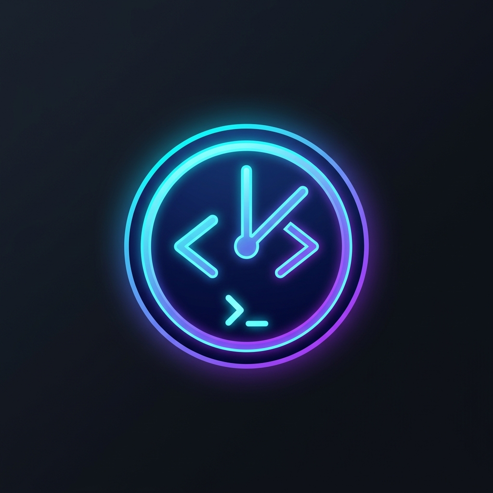
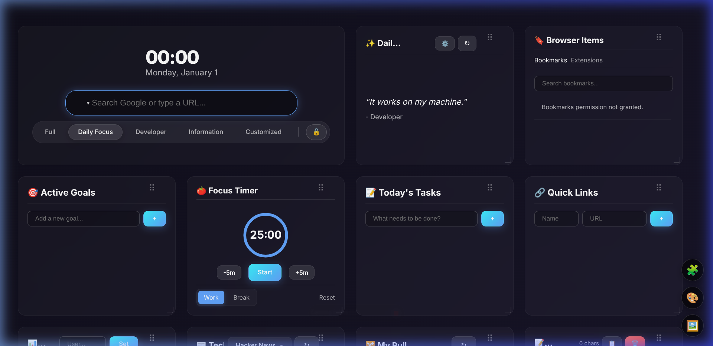
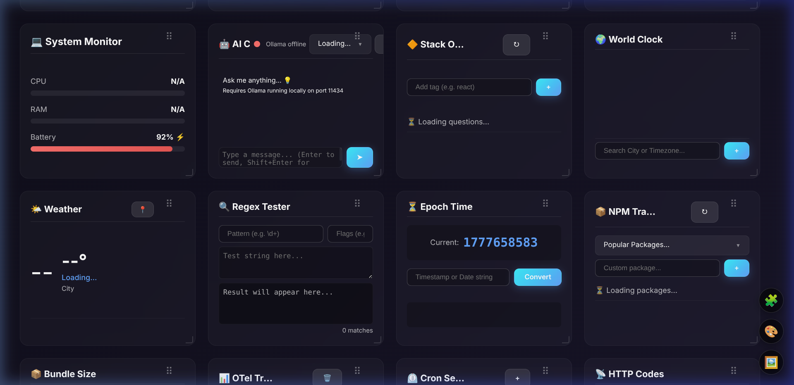
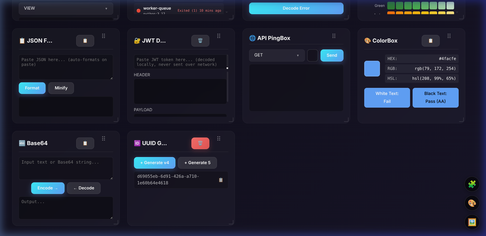
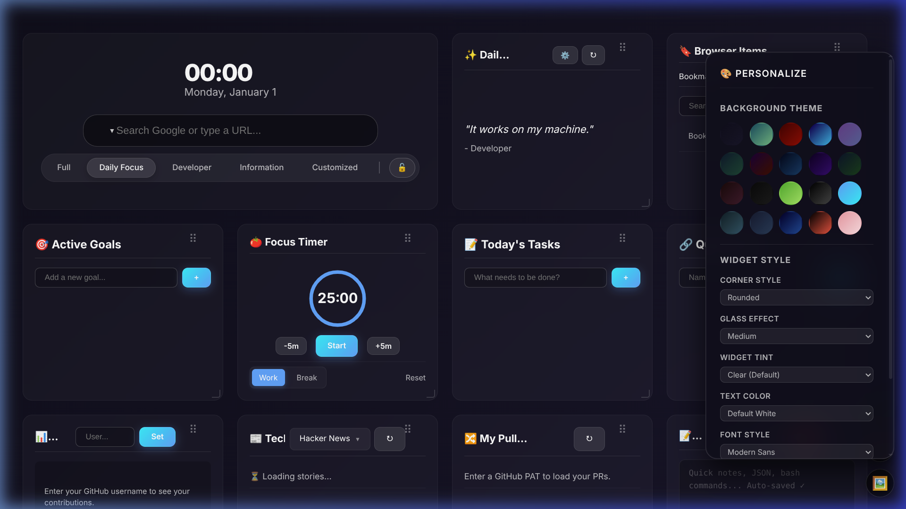
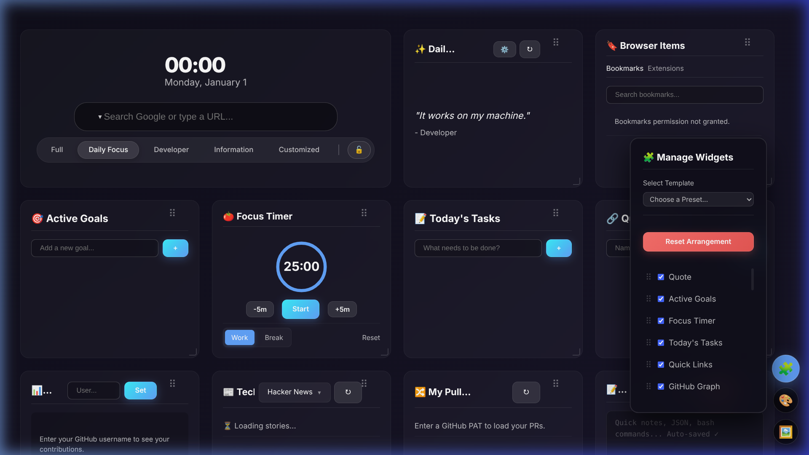

<p align="center">
  
</p>

<h1 align="center">🚀 DevDash</h1>

<p align="center">
  DevDash is a local‑first new‑tab dashboard for developers and creators that cuts context switching and helps you ship more work in less time — with your to‑dos, dev tools, system stats, and AI all in one focused view.
</p>

<p align="center">
  
  
  
  
  
</p>

---

## 📸 Dashboard Preview

<p align="center">
  <a href="../.github/screenshots/devdash/devdash_hero.png">
    
  </a>
  <br><em>Hero section with clock, multi-engine search bar, template quick-switcher, and productivity widgets</em>
</p>

<p align="center">
  <a href="../.github/screenshots/devdash/devdash_more_widgets.png">
    
  </a>
  <br><em>System Monitor, AI Chat, Weather, Regex Tester, Epoch Converter, NPM Tracker & more</em>
</p>

<p align="center">
  <a href="../.github/screenshots/devdash/devdash_devtools.png">
    
  </a>
  <br><em>JSON Formatter, JWT Decoder, API PingBox, ColorBox, Base64, UUID Generator</em>
</p>

---

## ✨ Why DevDash?

Every time you open a new tab, you see a **beautiful, productive workspace** instead of a blank page. DevDash is purpose-built for software engineers, offering:

- 🧰 **41+ widgets** covering productivity, dev utilities, system monitoring, and AI chat
- 🎨 **20 background themes** + glassmorphism widget styles with full personalization
- 🖼️ **Custom wallpaper** support (URL or local upload)
- 🔀 **Drag & drop** grid layout with resize handles
- 🔒 **Layout lock** to freeze your perfect arrangement
- 🤖 **Local AI chat** powered by Ollama — 100% private, zero cloud
- 🔍 **Multi-engine search** (Google, Bing, DuckDuckGo, Yahoo)
- 📱 **5 template presets** — switch your entire dashboard in one click
- 💾 **Everything auto-saved** locally — zero accounts, zero telemetry

---

## 🧩 Complete Widget Reference (41+ Widgets)

### ⏱️ Productivity & Focus

| Widget | Description | Key Actions |
|--------|-------------|-------------|
| **✨ Daily Inspiration** | Shows motivational/tech quotes | ↻ Refresh quote · ⚙️ Set custom quote & author · Auto-rotates from curated collection |
| **🎯 Active Goals** | Track top priorities for the day | ➕ Add goals · ✅ Check off completed · 🗑️ Delete · Persisted across sessions |
| **🍅 Focus Timer** | Built-in Pomodoro timer | ▶️ Start/Pause · ±5m adjust · Work/Break modes · Circular progress animation · Desktop notifications |
| **📝 Today's Tasks** | Quick persistent to-do list | ➕ Add tasks · ✅ Toggle complete (strikethrough) · 🗑️ Delete · Auto-saved |
| **🔗 Quick Links** | Customizable bookmark launcher | ➕ Add name + URL · Click to open · 🗑️ Delete · Favicon auto-detection |
| **📝 Scratchpad** | Auto-saving text area | 📋 Copy all · 🗑️ Clear · Character count · Monospace font · Perfect for JSON/bash snippets |

### 🌐 Information Hub

| Widget | Description | Key Actions |
|--------|-------------|-------------|
| **🌍 World Clock** | Multi-timezone tracker | 🔍 Search city/timezone · ➕ Add clocks · ❌ Remove · Live time updates |
| **🌤️ Weather** | Current conditions & hourly forecast | 📍 Auto-locate · Temperature, description, city · Hourly forecast strip · Weather icons |
| **📰 Tech News** | Live tech headlines feed | 📡 Sources: Hacker News, r/webdev, r/programming, r/javascript · ↻ Refresh · Click to read |
| **🔖 Browser Items** | Bookmarks & extensions viewer | 🔍 Search bookmarks · Tab switch: Bookmarks / Extensions · Click to navigate |

### 💻 Developer Utilities

| Widget | Description | Key Actions |
|--------|-------------|-------------|
| **🔍 Regex Tester** | Test regular expressions live | Pattern + flags input · Test string area · Highlighted matches · Match count |
| **⏳ Epoch Time** | Unix timestamp converter | Live current epoch (click to copy) · Bidirectional convert: timestamp ↔ human date |
| **📦 NPM Tracker** | NPM package stats dashboard | Popular presets (React, Vue, etc.) · Custom package search · Downloads, version, license info · ↻ Refresh |
| **📦 Bundle Size** | NPM bundle size estimator | Package name input · Minified & Gzipped sizes · Dependency info |
| **📋 JSON Formatter** | Format, minify & validate JSON | Auto-format on paste · Format / Minify buttons · Syntax highlighting · 📋 Copy output · Validation status |
| **🔐 JWT Decoder** | Decode JSON Web Tokens | Paste JWT · Header & Payload sections decoded · Expiry status indicator · 🗑️ Clear · 100% local decode |
| **🔤 Base64** | Encode & decode Base64 | Input textarea · Encode → / ← Decode buttons · 📋 Copy output · Status indicator |
| **🆔 UUID Generator** | Generate v4 UUIDs | + Generate v4 (single) · + Generate 5 (bulk) · Click to copy · 🗑️ Clear all |
| **🎨 ColorBox** | Color format converter + contrast checker | 🎨 Color picker · HEX / RGB / HSL output · WCAG contrast checker (white & black text) · 📋 Copy HEX |
| **🌐 API PingBox** | Quick HTTP request tester | GET / POST / PUT / DELETE · URL input · JSON body editor (auto-shown for POST) · Response output · Status & timing |
| **💻 Cmd CheatSheet** | Command reference guide | 🔍 Search commands · Categories: Files, Net, Proc, Perms, Zip, Git, Docker · Click to copy |
| **📡 HTTP Codes** | HTTP status code reference | 🔍 Search by code or keyword · Filter tabs: All, 1xx–5xx · Description + usage notes |
| **📐 DP/PX/SP** | CSS/Android unit converter | Numeric input · Unit selector (dp/px/sp) · Live conversion across all density buckets |

### 🛠️ Advanced Tools & DevOps

| Widget | Description | Key Actions |
|--------|-------------|-------------|
| **📊 GitHub Insights** | Contribution heatmap + profile stats | Enter username · Contribution graph visualization · Repos, followers, stars, gists stats |
| **🔀 PR Monitor** | Track open Pull Requests | 🔑 GitHub PAT authentication · Live PR list with status · Review state indicators · ↻ Refresh |
| **🔶 Stack Overflow** | Tag-based question watcher | ➕ Add tags (e.g. react, python) · 🏷️ Active tag pills · Live question feed · Score & answer count · ↻ Refresh |
| **⏲️ Cron Sentinel** | Cron expression manager | ➕ Add named cron jobs · Human-readable schedule translation · Edit/delete jobs |
| **🌐 Region Compass** | Cloud region directory & latency | AWS/GCP/Azure regions · 🏓 Ping to measure latency · Region details |
| **🔐 Env Vault** | Local .env variable manager | 📁 Multiple profiles · ➕ Add key-value pairs · 👁️ Toggle visibility · 📋 Copy all as `.env` format |
| **🔗 Intent Builder** | Android Intent URI builder | Scheme, host, path, package fields · Action selector (VIEW/SEND/EDIT/MAIN) · Live URI preview · 📋 Copy |
| **🐳 Docker Monitor** | Docker container status viewer | Container list with status · Start/stop timestamps · ↻ Refresh |
| **🛡️ IAM Decoder** | AWS/GCP IAM error explainer | Paste error message · Decode Error button · Structured explanation with fix suggestions |
| **🎨 Material Palette** | Material Design color picker | Full Material color grid · All shade variations · Click swatch to copy HEX · Color name labels |
| **📊 OTel TraceBox** | OpenTelemetry trace visualizer | Paste trace JSON · Visualize button · Waterfall timeline view · Span details · 🗑️ Clear |

### ⚡ FlowForge Productivity (Synced)

| Widget | Description | Key Actions |
|--------|-------------|-------------|
| **⚡ Habit Chains** | Habit stacking & chaining system | ➕ Add habit chain · ✅ Check off steps · 🔥 Track streaks · Synced with FlowForge |
| **📅 Time Blocks** | Visual daily schedule planner | 📅 View today's blocks · ⏱️ Live progress tracking · Synced with FlowForge |
| **🔥 Deep Work** | Deep work session statistics | 📊 View session count, total hours, and quality score · 📝 Recent session list · Synced with FlowForge |
| **🚀 Momentum** | Post-session task queue | ➕ Add tasks · ✅ Complete tasks · 🤖 AI-generated suggestions after deep work · Synced with FlowForge |
| **🔴 No Zero Days** | Daily goal & streak tracker | ➕ Add daily goals · ✅ Toggle completion · 🔥 Max streak tracking · Synced with FlowForge |

### 🖥️ System & AI Integration

| Widget | Description | Key Actions |
|--------|-------------|-------------|
| **💻 System Monitor** | Real-time system metrics | CPU usage bar + percentage · RAM usage bar + percentage · Battery level + charging status · Color-coded severity (green → yellow → red) |
| **🤖 AI Chat** | Local Ollama AI assistant | 🟢/🔴 Connection status · Model selector (auto-detects pulled models) · Streaming responses · Conversation history · 🗑️ Clear chat · Shift+Enter for newlines |

---

## 🎛️ Dashboard Controls & Actions

### 🔍 Multi-Engine Search Bar

The search bar sits prominently in the hero section. Click the engine icon dropdown to switch between:

| Engine | Shortcut |
|--------|----------|
| 🔵 **Google** | Default |
| 🟢 **Bing** | Click to switch |
| 🟠 **DuckDuckGo** | Click to switch |
| 🟣 **Yahoo** | Click to switch |

**Smart URL Detection**: Type a URL (e.g. `github.com`) and it navigates directly instead of searching.

### 📋 Template Quick Tray

Switch your entire dashboard layout with one click:

| Template | Widgets Shown |
|----------|---------------|
| **Full** | All 41+ widgets enabled |
| **Daily Focus** | Quote, Weather, Goals, Tasks, Links, Timer, Scratchpad, **Habit Chains, Time Blocks, Deep Work, Momentum, No Zero Days** |
| **Developer** | GitHub, System Monitor, Regex, Epoch, NPM, JSON, JWT, Base64, UUID, Stack Overflow, AI Chat, and all dev tools |
| **Information** | News, Stack Overflow, World Clock, Weather, GitHub |
| **Customized** | Your personal selection — auto-saved when you manually toggle widgets |

### 🔒 Layout Lock

Click the 🔓 lock button in the template tray to **freeze your layout**:
- Disables all drag-and-drop
- Hides resize handles
- Shows a "Dashboard is locked" banner notification
- Persists across page reloads
- Click again (🔒) to unlock

### 🎨 Theme Personalization Panel

<p align="center">
  <a href="../.github/screenshots/devdash/devdash_theme_panel.png">
    
  </a>
  <br><em>20 gradient themes + full widget style customization</em>
</p>

Click the 🎨 floating button to access:

| Setting | Options |
|---------|---------|
| **Background Theme** | 20 gradient themes: Dark, Hiker, Volcano, Cyber, Nebula, Aurora, Sunset, Ocean, Midnight, Forest, Rose, Carbon, Lush, Deep Space, Electric, Twilight, Royal, Frost, Magma, Candy |
| **Corner Style** | Sharp · Soft · Rounded · Extra Rounded · Circular |
| **Glass Effect** | Soft · Medium · Strong (controls blur intensity & opacity) |
| **Widget Tint** | Clear · Midnight · Electric Blue · Emerald Green · Amber |
| **Text Color** | Default White · Cyber Cyan · Golden · Emerald · Rose |
| **Font Style** | Modern Sans (Inter) · Classic Serif (Playfair) · Tech Mono (JetBrains) · Elegant Outfit · Clean Roboto |
| **Clock Size** | Small (4rem) · Medium (6rem) · Large (8rem) · Extra Large (12rem) |
| **Hero Position** | Left · Center · Right |

### 🖼️ Custom Wallpaper

Click the 🖼️ floating button to:
- **Set from URL** — paste any image URL (Unsplash, etc.)
- **Upload local image** — choose from your computer
- **Reset to default** — revert to gradient theme

### 🧩 Widget Manager

<p align="center">
  <a href="../.github/screenshots/devdash/devdash_widget_manager.png">
    
  </a>
  <br><em>Toggle individual widgets, reorder via drag, apply presets, and reset layout</em>
</p>

Click the 🧩 floating button to:
- **Toggle widgets** on/off with checkboxes
- **Reorder widgets** by dragging the ⠿ handle
- **Apply template presets** from the dropdown
- **Reset Arrangement** to restore default layout & visibility
- Any manual change auto-saves to the **Customized** template

### ✕ Quick Widget Removal

Hover over any widget to reveal a **✕ delete button** in the corner. Click it to instantly hide that widget. Your layout auto-switches to the "Customized" template.

### ↔️ Drag & Drop + Resize

- **Drag**: Grab any widget by its drag handle (⠿) to reorder
- **Resize**: Drag the corner/edge resize handles to change widget dimensions
- All positions and sizes persist across sessions

---

## 🛠️ Installation

### From Chrome Web Store

> 🔜 *Coming soon to the Chrome Web Store!*

### Manual Installation (Developer Mode)

1. **Download** — Clone or download this repository:
   ```bash
   git clone https://github.com/samargupta096/extensions-google-chrome.git
   ```

2. **Open Chrome Extensions** — Navigate to `chrome://extensions/`

3. **Enable Developer Mode** — Toggle the switch in the top-right corner

4. **Load Extension** — Click "Load unpacked" and select the `devdash/` folder

5. **Open a New Tab** — Your DevDash dashboard appears automatically!

### Optional: Enable AI Chat (Ollama)

For the AI Chat widget, install and run [Ollama](https://ollama.ai) locally:

```bash
# Install Ollama (macOS/Linux)
curl -fsSL https://ollama.ai/install.sh | sh

# Pull a model
ollama pull llama3.2

# Start the server
ollama serve

# Set CORS origins for Chrome extension access
OLLAMA_ORIGINS="*" ollama serve
```

The AI Chat widget will auto-detect connection status and available models.

---

## 🔒 Privacy & Security

| Principle | Details |
|-----------|---------|
| **100% Local Data** | All settings, notes, tasks, and configurations stored in `chrome.storage.local` |
| **Zero Telemetry** | No analytics, no tracking, no external servers collecting your data |
| **No Account Required** | Works immediately — no sign-up, no login, no cloud sync |
| **Local AI Only** | AI Chat runs through Ollama on your own machine — conversations never leave your device |
| **Direct API Calls** | Weather, GitHub, and news APIs are called directly from your browser — no proxy servers |
| **Open Source** | Full source code available — audit every line yourself |

---

## ⚙️ Technical Details

| Aspect | Details |
|--------|---------|
| **Framework** | Vanilla HTML/CSS/JS — zero dependencies, zero build step |
| **Manifest** | Chrome Extension Manifest V3 |
| **Permissions** | `storage`, `system.cpu`, `system.memory`, `bookmarks`, `management`, `alarms`, `notifications` |
| **Storage** | `chrome.storage.local` with `unlimitedStorage` |
| **AI Integration** | Ollama REST API (`localhost:11434`) with streaming responses |
| **Design System** | Glassmorphism cards, CSS custom properties, `backdrop-filter: blur()` |
| **Typography** | Inter (primary), with JetBrains Mono, Playfair Display, Outfit, Roboto options |
| **APIs Used** | OpenWeatherMap, GitHub API, Hacker News Firebase, Reddit JSON, Stack Exchange, NPM Registry, Bundlephobia |

### Project Structure

```
devdash/
├── manifest.json          # Chrome extension manifest
├── newtab.html            # Main dashboard page (replaces new tab)
├── focus.html             # Dedicated focus timer page
├── background.js          # Service worker for API relay & CORS handling
├── css/
│   └── newtab.css         # Complete dashboard styles (65KB)
├── js/
│   ├── clock.js           # Digital clock with 12/24h toggle
│   ├── search.js          # Multi-engine search bar
│   ├── theme.js           # 20 themes + widget style controls
│   ├── visibility.js      # Widget manager + templates
│   ├── drag.js            # Grid drag-and-drop system
│   ├── resize.js          # Widget resize handles
│   ├── lock.js            # Dashboard lock/freeze
│   ├── wallpaper.js       # Custom wallpaper (URL/upload)
│   ├── quotes.js          # Daily quote with custom support
│   ├── goals.js           # Active goals tracker
│   ├── timer.js           # Pomodoro focus timer
│   ├── todo.js            # Today's tasks
│   ├── links.js           # Quick links manager
│   ├── scratchpad.js      # Auto-saving notepad
│   ├── weather.js         # Weather widget + hourly forecast
│   ├── worldclock.js      # Multi-timezone clocks
│   ├── news.js            # Hacker News + Reddit feeds
│   ├── github.js          # GitHub contribution graph + stats
│   ├── ghmonitor.js       # PR monitor with PAT auth
│   ├── stackoverflow.js   # Tag-based SO question feed
│   ├── sysmonitor.js      # CPU/RAM/Battery monitor
│   ├── ollama.js          # AI Chat with streaming
│   ├── regex.js           # Regex tester
│   ├── epoch.js           # Unix epoch converter
│   ├── npmtracker.js      # NPM package tracker
│   ├── bundlesize.js      # Bundle size checker
│   ├── jsonformatter.js   # JSON format/minify
│   ├── jwt.js             # JWT decoder
│   ├── base64.js          # Base64 encode/decode
│   ├── uuid.js            # UUID v4 generator
│   ├── apitester.js       # API request tester
│   ├── colorutility.js    # Color converter + contrast
│   ├── cmdcheat.js        # Command cheatsheet
│   ├── httpref.js         # HTTP status code reference
│   ├── dppxconverter.js   # DP/PX/SP unit converter
│   ├── cronsentinel.js    # Cron expression manager
│   ├── regioncompass.js   # Cloud region directory
│   ├── envvault.js        # Env variable vault
│   ├── intentbuilder.js   # Android Intent URI builder
│   ├── dockermon.js       # Docker container monitor
│   ├── iamdecoder.js      # IAM error decoder
│   ├── materialpalette.js # Material Design colors
│   ├── traceviewer.js     # OTel trace visualizer
│   ├── flowforge-sync.js  # Cross-extension sync utility
│   ├── habitchain.js      # Habit chains widget
│   ├── timeblocks.js      # Time blocks widget
│   ├── deepworksession.js # Deep work session stats
│   ├── momentumqueue.js   # Momentum task queue
│   ├── nozeroday.js       # No Zero Days tracker
│   └── bookmarks.js       # Bookmarks & extensions viewer
├── shared/
│   ├── ui-components.css  # Shared design system
│   └── storage-utils.js   # Chrome storage helpers
└── icons/
    ├── icon16.png
    ├── icon48.png
    └── icon128.png
```

---

## 🎯 Who Is DevDash For?

- **Frontend developers** who need instant access to JSON, Regex, Base64, and color tools
- **Backend engineers** who regularly check HTTP codes, decode JWTs, and monitor Docker
- **Full-stack developers** who track PRs, NPM packages, and Stack Overflow tags
- **Android developers** who need DP/PX/SP conversions and Intent URI builders
- **DevOps engineers** who manage cron jobs, cloud regions, IAM policies, and env variables
- **Anyone** who wants a beautiful, productive new tab that respects their privacy

---

## 💡 Tips & Tricks

1. **Click the clock** to toggle between 12-hour and 24-hour format
2. **Click the epoch timestamp** to instantly copy it to clipboard
3. **Paste JSON** into the JSON Formatter — it auto-formats on paste
4. **Use Shift+Enter** in AI Chat for multiline messages
5. **Set a custom quote** with the ⚙️ button for personal motivation
6. **Lock your layout** once you've arranged widgets perfectly
7. **Use the Customized template** to save your personal widget selection
8. **Upload a wallpaper** from Unsplash for a stunning background
9. **Add SO tags** matching your tech stack for relevant questions
10. **Use multiple Env Vault profiles** for different projects

---

<p align="center">
  <strong>Built with 🧠 by a developer, for developers</strong><br>
  <em>Zero dependencies · Zero cloud · 100% private · Open source</em>
</p>
